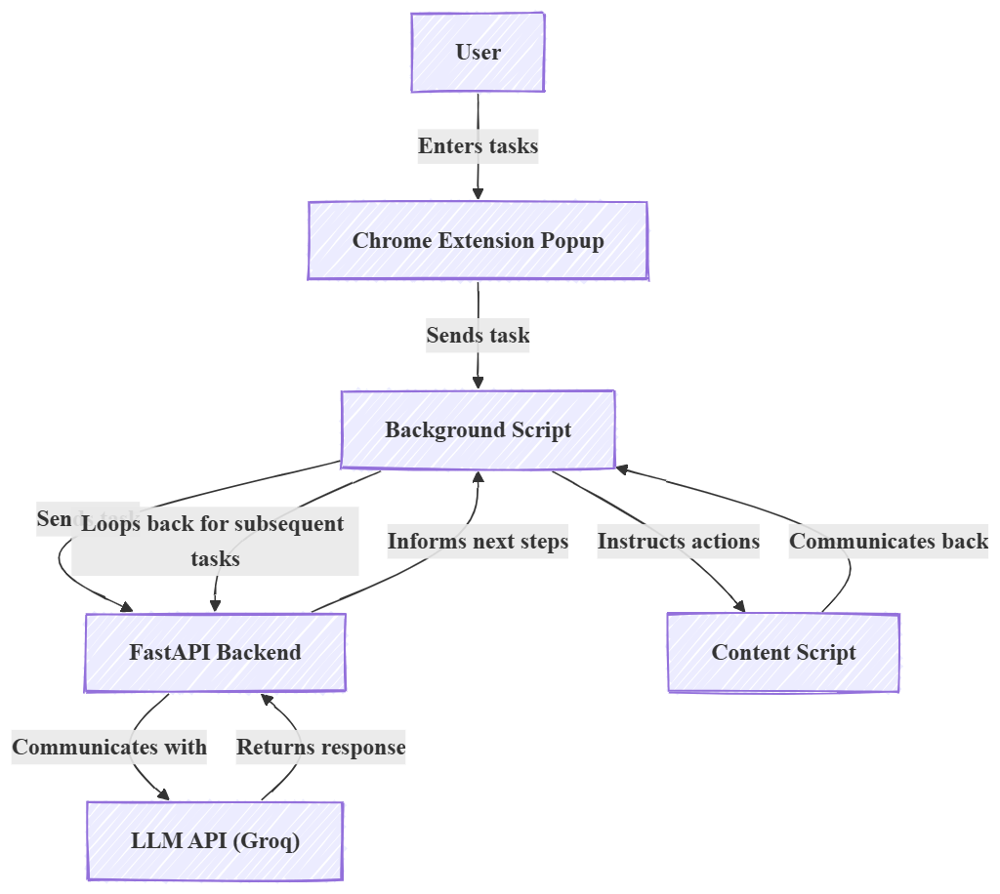
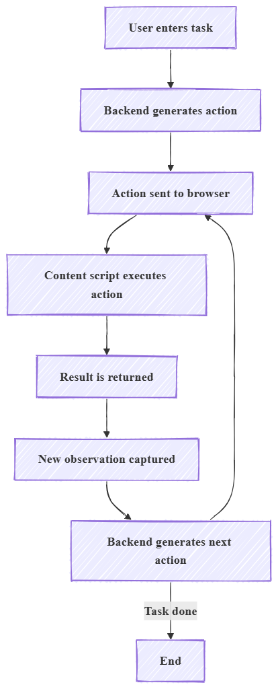
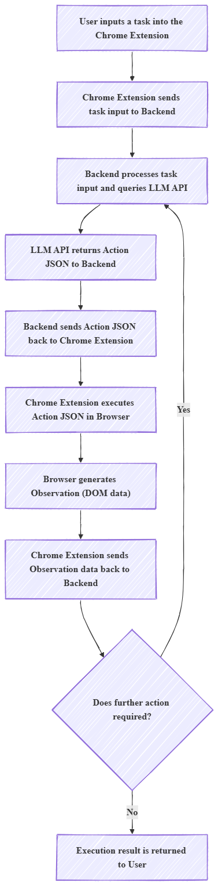

🧠 NavisAI – Autonomous Browser Agent

🌟 Overview

NavisAI is an AI-powered browser agent that can observe web pages, plan actions using an LLM, and execute tasks automatically with minimal human intervention.

It bridges:

🧠 AI reasoning (LLM) 🌐 Browser interaction (Chrome Extension) ⚙️ Backend decision engine (FastAPI)

⚙️ How It Works
User Task → Backend (/start_task)
          → Action → Browser (content.js)
          → Result + Observation
          → Backend (/next_step)
          → Repeat until DONE
🏗 Architecture
[Popup UI]
     ↓
[background.js]  ← agent loop
     ↓
[content.js]     ← executes actions (click, type)
     ↓
[FastAPI Backend]
     ↓
[LLM (Groq)]
✨ Key Features
🔹 AI-based task planning
🔹 Real-time page observation (DOM extraction)
🔹 Automated browser actions (click, type)
🔹 Iterative agent loop (plan → act → observe)
🔹 Structured JSON action system
🧠 Agent Workflow
1. User enters task
2. Backend generates action
3. Browser executes action
4. Result is captured
5. Next action is generated
6. Loop continues until "done"
🛠 Tech Stack
Frontend: HTML, CSS, JavaScript
Extension: Chrome Extension (Manifest V3)
Backend: FastAPI (Python)
AI Model: Groq API
Validation: Pydantic
🚀 Getting Started
1. Clone Repo
git clone https://github.com/anusha7s/NavisAI.git
cd NavisAI
2. Backend
pip install -r requirements.txt
uvicorn main:app --reload
3. Extension
Open chrome://extensions
Enable Developer Mode
Load extension/ folder
📡 API
/start_task

Generates first action

/next_step

Generates next action based on:

observation
last action
result
⚠️ Current Limitations
Limited actions (click, type only)
Partial multi-step loop
No retry/error handling
No tests yet
🚀 Future Improvements
Full autonomous loop completion
More actions (submit, scroll, wait)
Better UI state handling
Retry + timeout system
Test coverage

🎯 1. Architecture Diagram

🎯 2. Agent Workflow Diagram

🎯 3. Data Flow Diagram

